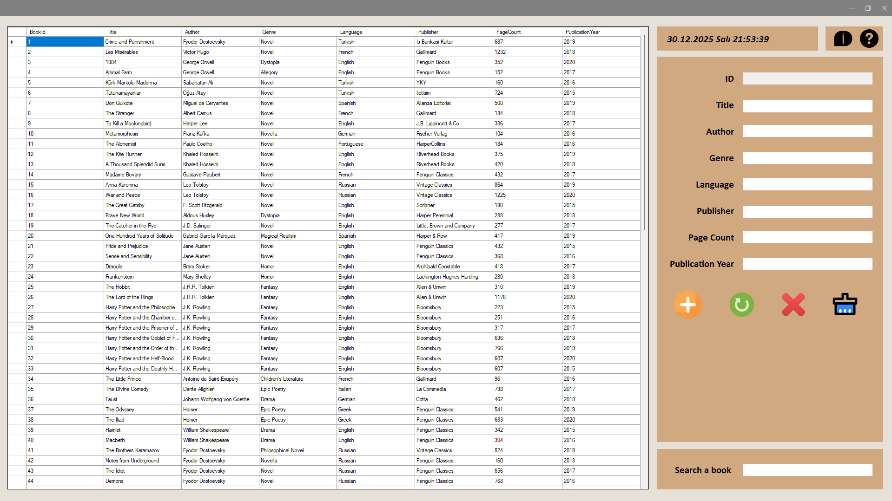
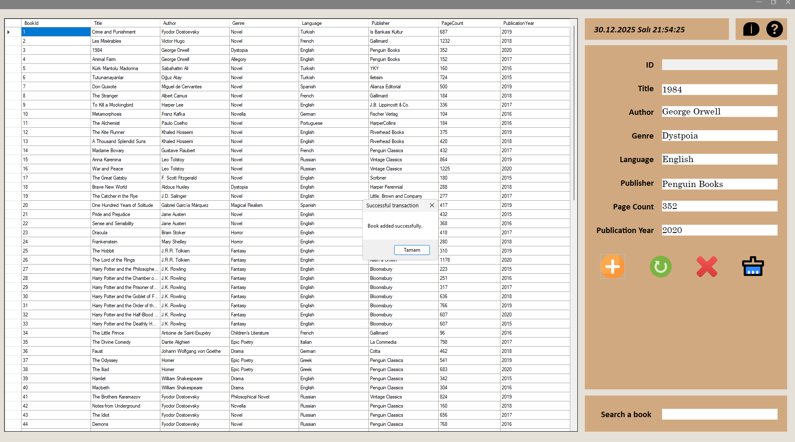
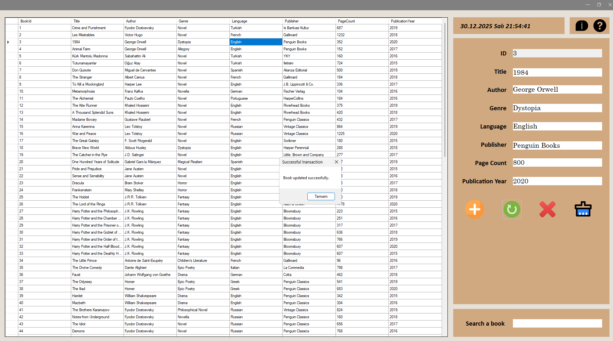
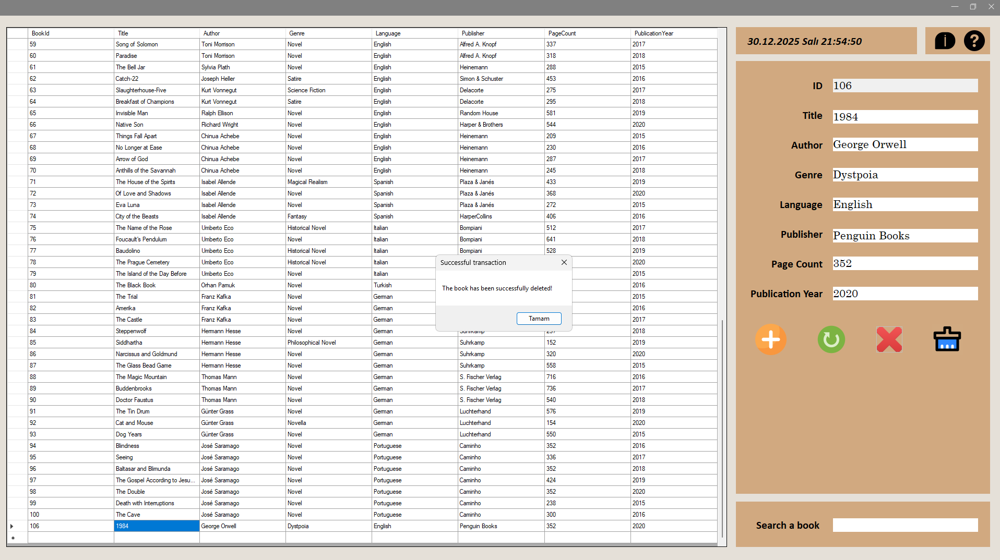
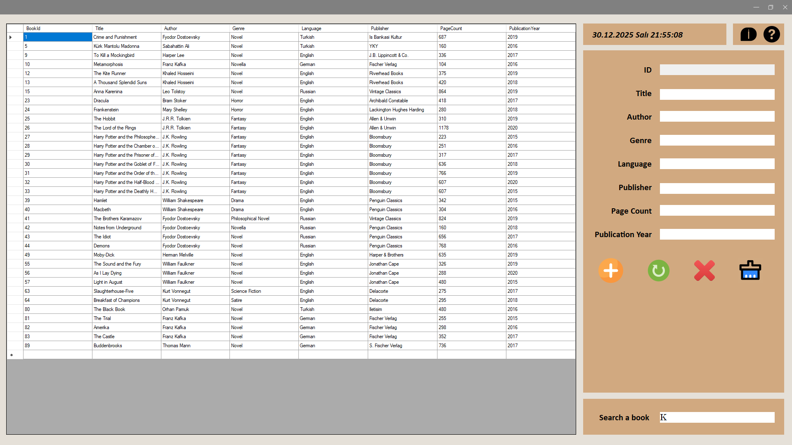
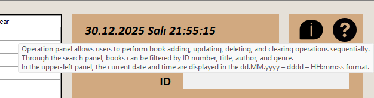
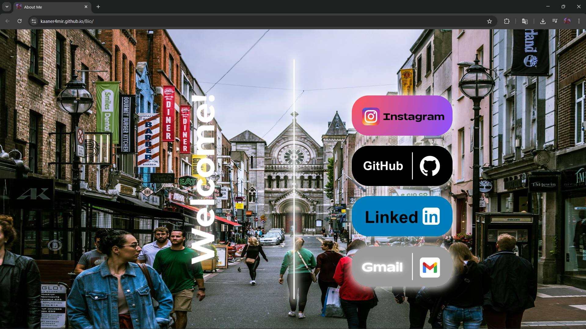

# 📚 Library Tracking System

A modern Windows Forms application for managing library books. You can add, update, delete, and search book information using SQL Server database.

## ✨ Features

- 📖 **Book Management**: Add, update, and delete books
- 🔍 **Advanced Search**: Search/filter books by ID, title, author, and genre
- 💾 **SQL Server Integration**: Secure and fast database operations
- 🎨 **Modern Interface**: Custom-designed borderless form and user-friendly panel
- ⏰ **Live Date/Time**: Real-time date and time display
- 🛡️ **Error Handling**: Safe operation with comprehensive try-catch blocks
- 📝 **Tooltip Help**: Informative tooltips in the user interface

## 🖼️ Screenshots

### Main Interface


### Operation Icons
 **Add** - Book addition button

 **Update** - Book information update button

 **Delete** - Book deletion button

 **Filter** - Search and filter icon

 **Info** - Information panel icon

 **Link** - External link icon

## 🛠️ Technologies

- **.NET Framework 4.7.2**
- **Windows Forms**
- **SQL Server**
- **C#**

## 📋 Requirements

- Windows Operating System
- .NET Framework 4.7.2 or higher
- SQL Server (Express or higher version)
- Visual Studio 2017 or higher (for development)

## 🚀 Installation

### 1. Clone the Repository

```bash
git clone https://github.com/Kaaner4mir/library-tracking-system.git
cd library-tracking-system
```

### 2. Create the Database

Run the following SQL command using SQL Server Management Studio (SSMS):

```sql
CREATE DATABASE BooksDB;
GO

USE BooksDB;
GO

CREATE TABLE Books (
    BookId INT PRIMARY KEY IDENTITY(1,1),
    Title NVARCHAR(255) NOT NULL,
    Genre NVARCHAR(100),
    Author NVARCHAR(255),
    Language NVARCHAR(50),
    Publisher NVARCHAR(255),
    PageCount INT,
    PublicationYear INT
);
```

### 3. Configure the Connection String

Edit the connection string in the `App.config` file according to your SQL Server information:

```xml
<connectionStrings>
    <add name="BooksDB"
         connectionString="Data Source=YOUR_SERVER_NAME\SQLEXPRESS;Initial Catalog=BooksDB;Integrated Security=True;Encrypt=False"
         providerName="System.Data.SqlClient" />
</connectionStrings>
```

**Note:** Replace `YOUR_SERVER_NAME\SQLEXPRESS` with your own SQL Server server name.

### 4. Build the Project

Open the project in Visual Studio and press `F5` to run it, or build it from the `Build > Build Solution` menu.

## 📖 Usage

### Adding a Book
1. Fill out the form in the right panel (leave the ID field empty)
2. Click the "Save" button

### Updating a Book
1. Click on the book you want to update from the list on the left
2. Edit the information in the right panel
3. Click the "Update" button

### Deleting a Book
1. Click on the book you want to delete from the list on the left
2. Click the "Delete" button
3. Select "Yes" in the confirmation message

### Searching for Books
You can filter books by entering ID, title, author, or genre information in the search box.

## 📁 Project Structure

```
LibraryTrackingSystem/
├── Form1.cs                 # Main form and business logic
├── Form1.Designer.cs        # Form design
├── Program.cs               # Application entry point
├── App.config               # Configuration file
├── Images/                  # Image files
└── Items/                   # Icon files
```

## 🔧 Development

To develop the project:

1. Open the project in Visual Studio
2. Run the `LibraryTrackingSystem.sln` file
3. Edit and test the code

## 🤝 Contributing

We welcome your contributions! Please follow these steps:

1. Fork this repository
2. Create a new branch (`git checkout -b feature/NewFeature`)
3. Commit your changes (`git commit -m 'Add new feature'`)
4. Push your branch (`git push origin feature/NewFeature`)
5. Create a Pull Request

## 📝 License

This project is licensed under the MIT License. See the [LICENSE](LICENSE) file for details.

## 👤 Author

**Kaaner4mir**

- GitHub: [@Kaaner4mir](https://github.com/Kaaner4mir)
- Website: [https://kaaner4mir.github.io/Bio/](https://kaaner4mir.github.io/Bio/)

## 🙏 Acknowledgments

Thank you for using this project! You can open an issue for questions or suggestions.

---

⭐ If you liked this project, don't forget to give it a star!

